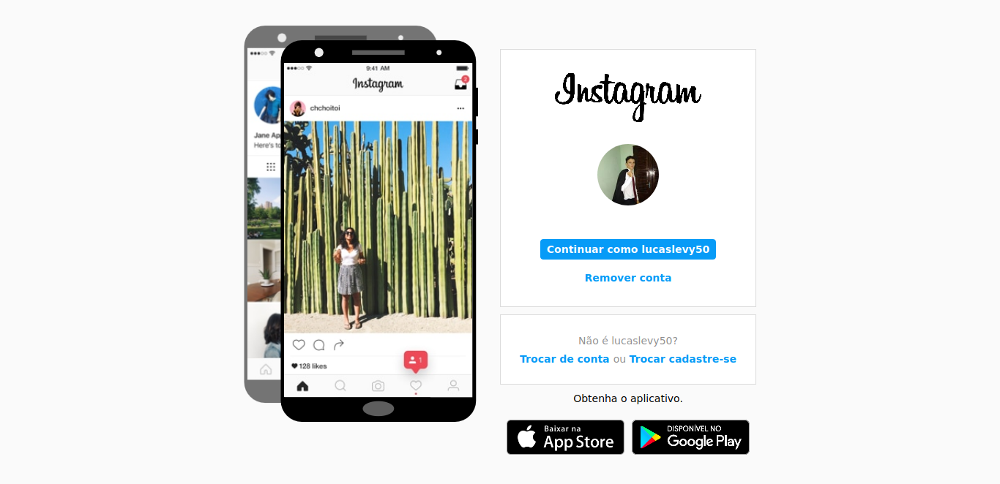
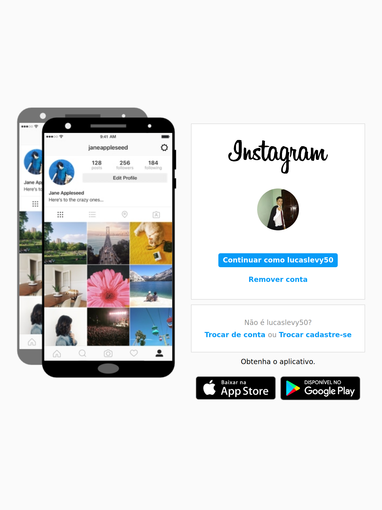
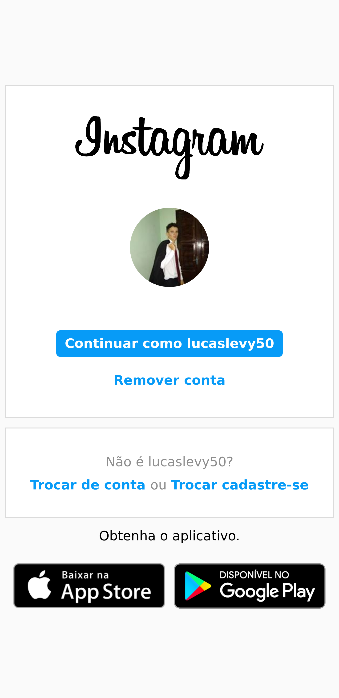

# Clone da página inicial do instagram

**Criado durante o Bootcamp Everis FullStack Developer**

---

##### Tecnologias usadas
Foi utilizado o HTML5 para marcação de texto, CSS3 para estilização e o JavaScript para interação com o usuário.

##### O que tem?
1. **Slide funcional**;
2. Imagens do instagram em uso;
3. Botões de download para Android e IOS;
4. Logo Instagram
5. Imagem do usuário

***

#### Prints

* Print em desktop

* Print em tablet

* Print em smartphone
